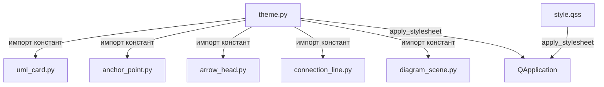

# Design Document: view-styles-extraction

## Overview

Рефакторинг view-слоя приложения LogicCraft: вынос всех захардкоженных визуальных констант (цвета, шрифты, толщины линий) из Python-кода в централизованное хранилище `theme.py` и QSS-файл `style.qss`.

Цель — устранить дублирование стилей, разбросанных по 6 файлам view-слоя, и создать единую точку управления внешним видом. После рефакторинга изменение любого цвета или шрифта потребует правки только в `theme.py` или `style.qss`.

Рефакторинг не меняет поведение приложения и не затрагивает бизнес-логику — только организацию визуальных констант.

### Текущее состояние (проблема)

В 5 файлах view-слоя присутствуют захардкоженные строки цветов:

| Файл | Захардкоженные значения |
|------|------------------------|
| `uml_card.py` | `#f5f5dc`, `#4169E1`, `#2c3e50`, `#27ae60`, `#DC143C`, `white` |
| `anchor_point.py` | `#FF6B6B`, `#FF4444`, `#FFFFFF` |
| `arrow_head.py` | `#666666` (×4 типа связи) |
| `connection_line.py` | `#666666`, `#DC143C` |
| `diagram_scene.py` | `#fafafa`, `#e0e0e0`, `#4169E1` |

Файлы `theme.py` и `style.qss` существуют, но пусты.

---

## Architecture

### Принцип организации

Архитектура следует паттерну **Centralized Style Registry**: все визуальные константы определяются в одном месте и потребляются через импорт.

```
theme.py (Style_Manager)
    ├── CardStyle       — стили UMLCard
    ├── ConnectionStyle — стили ConnectionLine
    ├── SceneStyle      — стили DiagramScene
    ├── AnchorStyle     — стили AnchorPoint
    └── ArrowStyle      — стили ArrowHead

style.qss (QSS_File)
    ├── /* Toolbar */
    ├── /* Dialogs */
    └── /* StatusBar */
```

### Поток данных



### Разделение ответственности

- **`theme.py`** — хранит `Graphics_Style` токены (для `QGraphicsItem`, которые не поддерживают QSS напрямую) и предоставляет метод `apply_stylesheet(app)` для загрузки QSS
- **`style.qss`** — хранит QSS-правила для стандартных Qt-виджетов (тулбар, диалоги, статусбар)
- **View-компоненты** — только потребляют токены, не определяют стили самостоятельно

---

## Components and Interfaces

### Style_Manager (`theme.py`)

Модуль с dataclass-секциями стилей и функцией применения QSS.

```python
# Пример структуры theme.py

from dataclasses import dataclass
from PyQt6.QtGui import QColor, QFont, QPen, QBrush
from PyQt6.QtCore import Qt
import logging
import os

@dataclass(frozen=True)
class _CardStyle:
    BACKGROUND: str = "#f5f5dc"
    BORDER: str = "#4169E1"
    SELECTED_BORDER: str = "#DC143C"
    HEADER_BG: str = "#4169E1"
    HEADER_TEXT: str = "white"
    ATTRS_TEXT: str = "#2c3e50"
    METHODS_TEXT: str = "#27ae60"
    DIVIDER: str = "#4169E1"
    BORDER_WIDTH: int = 2
    SELECTED_BORDER_WIDTH: int = 3
    HEADER_FONT: QFont = None  # инициализируется в __post_init__
    ATTRS_FONT: QFont = None
    METHODS_FONT: QFont = None

CardStyle = _CardStyle()

@dataclass(frozen=True)
class _ConnectionStyle:
    LINE_COLOR: str = "#666666"
    LINE_WIDTH: int = 2
    SELECTED_COLOR: str = "#DC143C"
    SELECTED_WIDTH: int = 3
    TEMP_LINE_COLOR: str = "#4169E1"  # используется в DiagramScene

ConnectionStyle = _ConnectionStyle()

@dataclass(frozen=True)
class _SceneStyle:
    BACKGROUND: str = "#fafafa"
    GRID_COLOR: str = "#e0e0e0"
    GRID_WIDTH: float = 0.5
    GRID_STEP: int = 50
    TEMP_LINE_COLOR: str = "#4169E1"

SceneStyle = _SceneStyle()

@dataclass(frozen=True)
class _AnchorStyle:
    NORMAL_COLOR: str = "#FF6B6B"
    HOVER_COLOR: str = "#FF4444"
    BORDER_COLOR: str = "#FFFFFF"
    BORDER_WIDTH: float = 1.5
    HOVER_SCALE: float = 1.2

AnchorStyle = _AnchorStyle()

@dataclass(frozen=True)
class _ArrowStyle:
    COLOR: str = "#666666"
    WIDTH_NORMAL: float = 2.0
    WIDTH_THIN: float = 1.5
    SIZE: int = 12

ArrowStyle = _ArrowStyle()

def apply_stylesheet(app) -> None:
    """Загружает и применяет style.qss к QApplication"""
    ...
```

**Интерфейс `apply_stylesheet`:**
- Принимает объект `QApplication`
- Ищет `style.qss` относительно пакета `logiccraft`
- При отсутствии файла логирует предупреждение через `logging.warning()` и возвращает управление без исключения
- При успехе вызывает `app.setStyleSheet(qss_content)`

### Изменения в view-компонентах

Каждый компонент заменяет строковые литералы на обращения к токенам:

```python
# До (uml_card.py)
self.setBrush(QBrush(QColor("#f5f5dc")))
self.setPen(QPen(QColor("#4169E1"), 2))

# После
from ..theme import CardStyle
self.setBrush(QBrush(QColor(CardStyle.BACKGROUND)))
self.setPen(QPen(QColor(CardStyle.BORDER), CardStyle.BORDER_WIDTH))
```

### QSS-файл (`style.qss`)

```css
/* === Toolbar === */
QToolBar {
    background-color: #f0f0f0;
    border-bottom: 1px solid #cccccc;
    spacing: 4px;
}

/* === Dialogs === */
QDialog {
    background-color: #ffffff;
}

/* === StatusBar === */
QStatusBar {
    background-color: #f0f0f0;
    color: #333333;
}
```

---

## Data Models

### Style Token

Каждый Style_Token — это именованная константа в одной из секций `theme.py`. Токены организованы по компонентам:

| Секция | Токены | Тип значения |
|--------|--------|--------------|
| `CardStyle` | `BACKGROUND`, `BORDER`, `SELECTED_BORDER`, `HEADER_BG`, `HEADER_TEXT`, `ATTRS_TEXT`, `METHODS_TEXT`, `DIVIDER`, `BORDER_WIDTH`, `SELECTED_BORDER_WIDTH`, `HEADER_FONT`, `ATTRS_FONT`, `METHODS_FONT` | `str` (hex), `int`, `QFont` |
| `ConnectionStyle` | `LINE_COLOR`, `LINE_WIDTH`, `SELECTED_COLOR`, `SELECTED_WIDTH` | `str` (hex), `int` |
| `SceneStyle` | `BACKGROUND`, `GRID_COLOR`, `GRID_WIDTH`, `GRID_STEP`, `TEMP_LINE_COLOR` | `str` (hex), `float`, `int` |
| `AnchorStyle` | `NORMAL_COLOR`, `HOVER_COLOR`, `BORDER_COLOR`, `BORDER_WIDTH`, `HOVER_SCALE` | `str` (hex), `float` |
| `ArrowStyle` | `COLOR`, `WIDTH_NORMAL`, `WIDTH_THIN`, `SIZE` | `str` (hex), `float`, `int` |

### Маппинг исходных цветов на токены

| Исходный цвет | Токен |
|---------------|-------|
| `#f5f5dc` | `CardStyle.BACKGROUND` |
| `#4169E1` | `CardStyle.BORDER`, `CardStyle.HEADER_BG`, `CardStyle.DIVIDER`, `SceneStyle.TEMP_LINE_COLOR` |
| `#2c3e50` | `CardStyle.ATTRS_TEXT` |
| `#27ae60` | `CardStyle.METHODS_TEXT` |
| `#DC143C` | `CardStyle.SELECTED_BORDER`, `ConnectionStyle.SELECTED_COLOR` |
| `#666666` | `ConnectionStyle.LINE_COLOR`, `ArrowStyle.COLOR` |
| `#FF6B6B` | `AnchorStyle.NORMAL_COLOR` |
| `#FF4444` | `AnchorStyle.HOVER_COLOR` |
| `#FFFFFF` | `AnchorStyle.BORDER_COLOR` |
| `#fafafa` | `SceneStyle.BACKGROUND` |
| `#e0e0e0` | `SceneStyle.GRID_COLOR` |

---

## Correctness Properties

*A property is a characteristic or behavior that should hold true across all valid executions of a system — essentially, a formal statement about what the system should do. Properties serve as the bridge between human-readable specifications and machine-verifiable correctness guarantees.*

Для данного рефакторинга PBT применим: компоненты view-слоя — это объекты с чётким поведением (цвет кисти/пера), которое должно выполняться для любого экземпляра. Генераторы могут создавать произвольные экземпляры компонентов и проверять инварианты цветов.

Используемая библиотека: **Hypothesis** (Python PBT-библиотека, минимум 100 итераций на тест).

---

### Property 1: UMLCard использует цвета из CardStyle при инициализации

*For any* созданного экземпляра `UMLCard` с произвольными именем, атрибутами и методами, цвет фона (`brush().color()`) должен совпадать с `QColor(CardStyle.BACKGROUND)`, а цвет рамки (`pen().color()`) — с `QColor(CardStyle.BORDER)`.

**Validates: Requirements 2.1**

---

### Property 2: UMLCard использует цвет выделения из CardStyle

*For any* экземпляра `UMLCard`, после вызова `setSelected(True)` цвет пера должен совпадать с `QColor(CardStyle.SELECTED_BORDER)`, а после `setSelected(False)` — возвращаться к `QColor(CardStyle.BORDER)`.

**Validates: Requirements 2.2**

---

### Property 3: UMLCard использует шрифты из CardStyle

*For any* экземпляра `UMLCard`, шрифт заголовка (`header_text.font()`) должен совпадать с `CardStyle.HEADER_FONT`, шрифт атрибутов — с `CardStyle.ATTRS_FONT`, шрифт методов — с `CardStyle.METHODS_FONT`.

**Validates: Requirements 2.3**

---

### Property 4: AnchorPoint использует цвета из AnchorStyle

*For any* экземпляра `AnchorPoint`, цвет кисти в нормальном состоянии должен совпадать с `QColor(AnchorStyle.NORMAL_COLOR)`, после `hoverEnterEvent` — с `QColor(AnchorStyle.HOVER_COLOR)`, после `hoverLeaveEvent` — возвращаться к `QColor(AnchorStyle.NORMAL_COLOR)`.

**Validates: Requirements 3.1, 3.2, 3.3**

---

### Property 5: ArrowHead использует цвета из ArrowStyle для любого типа связи

*For any* значения `ConnectionType` (ASSOCIATION, INHERITANCE, COMPOSITION, AGGREGATION), созданный `ArrowHead` должен использовать цвет пера из `ArrowStyle.COLOR`, а не из строковых литералов.

**Validates: Requirements 4.1, 4.2, 4.3, 4.4**

---

### Property 6: ConnectionLine использует цвета из ConnectionStyle

*For any* экземпляра `ConnectionLine`, цвет пера в нормальном состоянии должен совпадать с `QColor(ConnectionStyle.LINE_COLOR)`, а после `set_selected(True)` — с `QColor(ConnectionStyle.SELECTED_COLOR)`.

**Validates: Requirements 5.1, 5.2**

---

### Property 7: DiagramScene использует цвет фона из SceneStyle

*For any* экземпляра `DiagramScene`, цвет фона (`backgroundBrush().color()`) должен совпадать с `QColor(SceneStyle.BACKGROUND)`.

**Validates: Requirements 6.1**

---

### Property 8: Обратная совместимость цветов

*For any* компонента view-слоя (UMLCard, AnchorPoint, ArrowHead, ConnectionLine, DiagramScene), цвета, возвращаемые через Style_Manager, должны совпадать с исходными захардкоженными значениями из таблицы маппинга в Data Models.

**Validates: Requirements 9.1, 9.2, 9.3**

---

## Error Handling

### Отсутствие файла `style.qss`

- `apply_stylesheet(app)` перехватывает `FileNotFoundError`
- Логирует: `logging.warning("style.qss not found at %s, skipping stylesheet", path)`
- Возвращает управление без вызова `app.setStyleSheet()`
- Приложение продолжает работу с системными стилями Qt

### Некорректный путь к `style.qss`

- Путь вычисляется относительно `__file__` модуля `theme.py` через `os.path`
- Это исключает зависимость от текущей рабочей директории

### Отсутствие токена в Style_Manager

- Поскольку токены — замороженные dataclass-константы, отсутствие токена означает ошибку разработчика, а не рантайм-ошибку
- Компоненты не должны иметь fallback-логики для отсутствующих токенов — это выявляется на этапе разработки через `AttributeError`

---

## Testing Strategy

### Подход

Используется двойная стратегия тестирования:
- **Unit-тесты** — конкретные примеры, структурные проверки, smoke-тесты
- **Property-тесты** — универсальные инварианты цветов для любых экземпляров компонентов (Hypothesis, ≥100 итераций)

### Property-тесты (Hypothesis)

Каждый property-тест реализует одно из Correctness Properties:

```python
# Тег формата: Feature: view-styles-extraction, Property N: <текст>

from hypothesis import given, settings
from hypothesis import strategies as st

# Feature: view-styles-extraction, Property 1: UMLCard использует цвета из CardStyle при инициализации
@given(
    name=st.text(min_size=1, max_size=50),
    attrs=st.lists(st.text(max_size=30), max_size=5),
    methods=st.lists(st.text(max_size=30), max_size=5)
)
@settings(max_examples=100)
def test_uml_card_uses_card_style_colors(name, attrs, methods):
    card = UMLCard(name, attributes=attrs, methods=methods)
    assert card.brush().color() == QColor(CardStyle.BACKGROUND)
    assert card.pen().color() == QColor(CardStyle.BORDER)
```

Конфигурация: `@settings(max_examples=100)` для каждого property-теста.

### Unit-тесты

| Тест | Что проверяет | Требование |
|------|---------------|------------|
| `test_theme_has_all_sections` | Наличие CardStyle, ConnectionStyle, SceneStyle, AnchorStyle, ArrowStyle | 1.1, 1.2, 8.1 |
| `test_theme_tokens_accessible_without_init` | Импорт theme не требует инициализации | 1.4 |
| `test_theme_contains_all_original_colors` | Все 11 исходных цветов присутствуют в токенах | 1.5 |
| `test_apply_stylesheet_calls_set_stylesheet` | apply_stylesheet вызывает app.setStyleSheet | 7.1, 7.2, 7.3 |
| `test_apply_stylesheet_missing_file` | Отсутствие style.qss не вызывает исключение | 7.4 |
| `test_scene_grid_uses_scene_style` | drawBackground использует SceneStyle через mock QPainter | 6.2 |
| `test_scene_temp_line_uses_scene_style` | start_connection создаёт линию с цветом из SceneStyle | 6.3 |

### Smoke-тесты (статический анализ)

Проверяют отсутствие строковых литералов цветов в исходном коде после рефакторинга:

```python
import re, ast

COLOR_PATTERN = re.compile(r'"#[0-9A-Fa-f]{6}"')

def test_no_hardcoded_colors_in_uml_card():
    source = Path("src/logiccraft/view/widgets/uml_card.py").read_text()
    assert not COLOR_PATTERN.search(source)
```

Аналогичные тесты для `anchor_point.py`, `arrow_head.py`, `connection_line.py`, `diagram_scene.py`.

### Покрытие требований

| Требование | Тип теста | Тест |
|------------|-----------|------|
| 1.1–1.5 | Unit | `test_theme_*` |
| 2.1 | Property 1 | `test_uml_card_uses_card_style_colors` |
| 2.2 | Property 2 | `test_uml_card_selected_uses_card_style` |
| 2.3 | Property 3 | `test_uml_card_uses_card_style_fonts` |
| 2.5 | Smoke | `test_no_hardcoded_colors_in_uml_card` |
| 3.1–3.3 | Property 4 | `test_anchor_point_uses_anchor_style` |
| 3.4 | Smoke | `test_no_hardcoded_colors_in_anchor_point` |
| 4.1–4.4 | Property 5 | `test_arrow_head_uses_arrow_style` |
| 4.5 | Smoke | `test_no_hardcoded_colors_in_arrow_head` |
| 5.1–5.2 | Property 6 | `test_connection_line_uses_connection_style` |
| 5.3 | Smoke | `test_no_hardcoded_colors_in_connection_line` |
| 6.1 | Property 7 | `test_diagram_scene_uses_scene_style_background` |
| 6.2–6.3 | Unit | `test_scene_grid_*`, `test_scene_temp_line_*` |
| 6.4 | Smoke | `test_no_hardcoded_colors_in_diagram_scene` |
| 7.1–7.5 | Unit | `test_apply_stylesheet_*` |
| 9.1–9.3 | Property 8 | `test_backward_compatibility_colors` |
